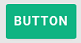
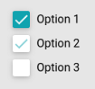
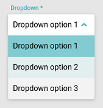
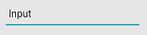
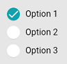
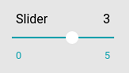
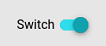
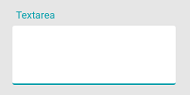
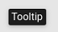

Components
=====

button
------------

* *id* : ``string`` - Unique ID
* *label* : ``string`` - Label
* *icon* : ``string`` - Icon name
* *href* : ``string`` - Link to open on click

checkboxes
------------

* **id** : ``string`` - Unique ID
* **options** - ``object list`` - List of options
	* **id** : ``string`` - Option unique ID
	* *value* : ``string = ::id`` - Option custom value, id by default
	* *checked* : ``boolean = ::false|true`` - Is option checked
	* **label** : ``string`` - Option label
	

dropdown
------------

* *id* : ``string`` - Unique ID
* **label** : ``string`` - Choices placeholder
* *required* : ``boolean = ::false|true`` - Is this form field required
* *value* : ``string`` - Selected value (eg. database ObjectID)
* **choices** : ``object list`` - List of choices
	* **label** : ``string`` - Choice label
	* **value** : ``string`` - Choice value (eg. database ObjectID)

  
icon
------------
* **icon** : ``string`` - Icon name
  
input
------------

* **id** : ``string`` - Unique ID
* **label** : ``string`` - Label of the input
* *type* : ``string = ::text|textarea|password`` - Type of the input
* *required* : ``boolean = ::false|true`` - Is this form field required
* *value* : ``string`` - Predefined value

radios
------------

* **id** : ``string`` - General name of radios
* **options** : ``object list`` - List of options
	* **id** : ``string`` - Unique option ID
	* **label** : ``string`` - Option label
	* *value* : ``string = ::id`` - Option value
	* *checked* : ``boolean = ::false|true`` - Is the option checked by default

  
slider
------------
* **id** : ``string`` - Unique ID
* **label** : ``string`` - Label of the slider
* **value** : ``int`` - Number of value as default
* **values** : ``string list`` - List of values
* *required* : ``boolean = ::false|true`` - Is this form field required

switch
------------

* **id** : ``string`` - Unique ID
* **label** : ``string`` - Switch label
* *value* : ``boolean = ::false|true`` - Off / On state

textarea
------------

* **id** : ``string`` - Unique ID
* **label** : ``string`` - Label of the textarea
* *required* : ``boolean = ::false|true`` - Is this form field required

tooltip
------------
* **label** : ``string`` - Label of the tooltip
* *direction* : ``string = left|right|top|bottom`` - Direction of tooltip pointing to

